# Orgo UI screenshots — 2026-09-17

> Generated documentation screenshots. These images are visual documentation only; they are not functional, security, or acceptance evidence.

Generated: `2026-09-17T18:36:59.165Z`

Viewport: `1440 × 1000`

## Today

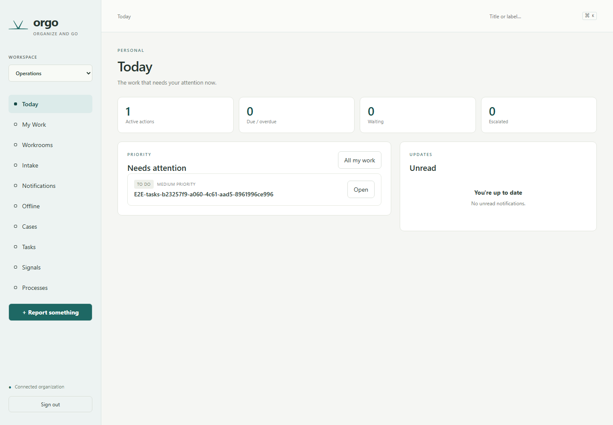

## My Work

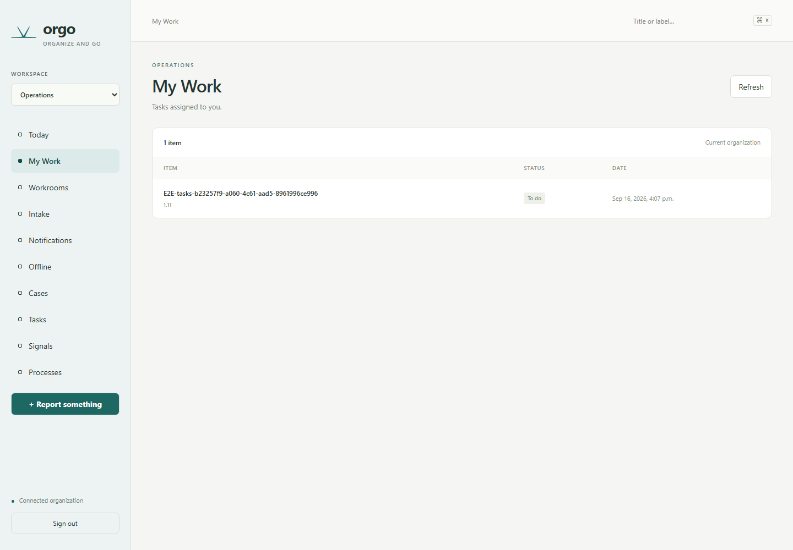

## Workrooms

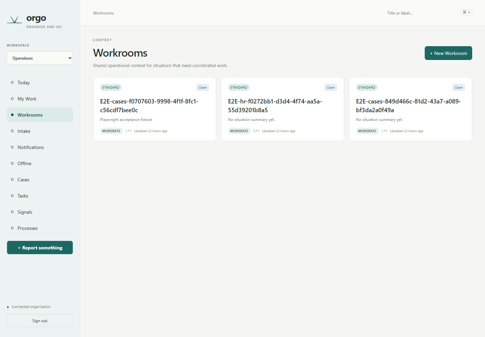

## Workroom — Overview

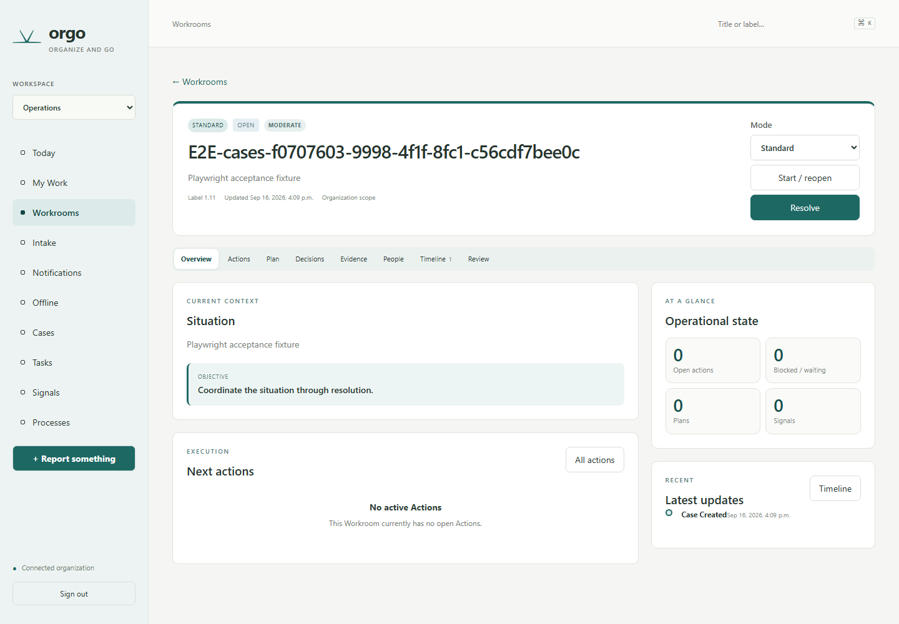

## Workroom — Actions

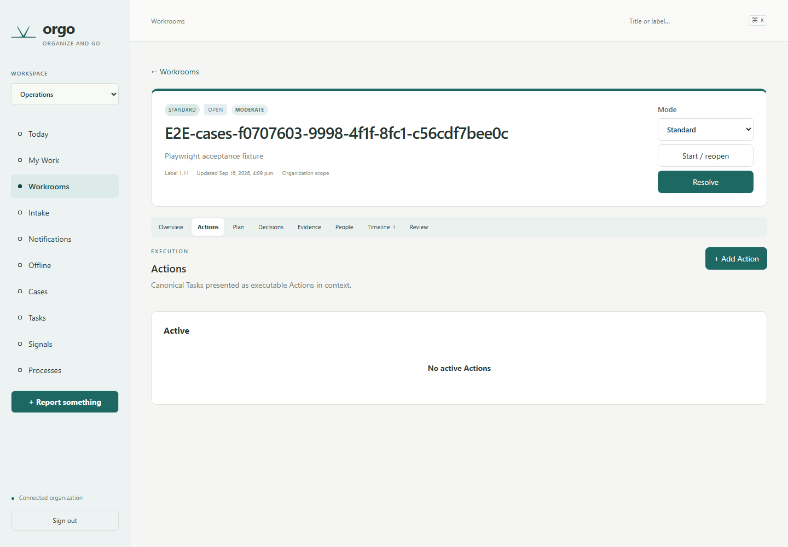

## Workroom — Plan

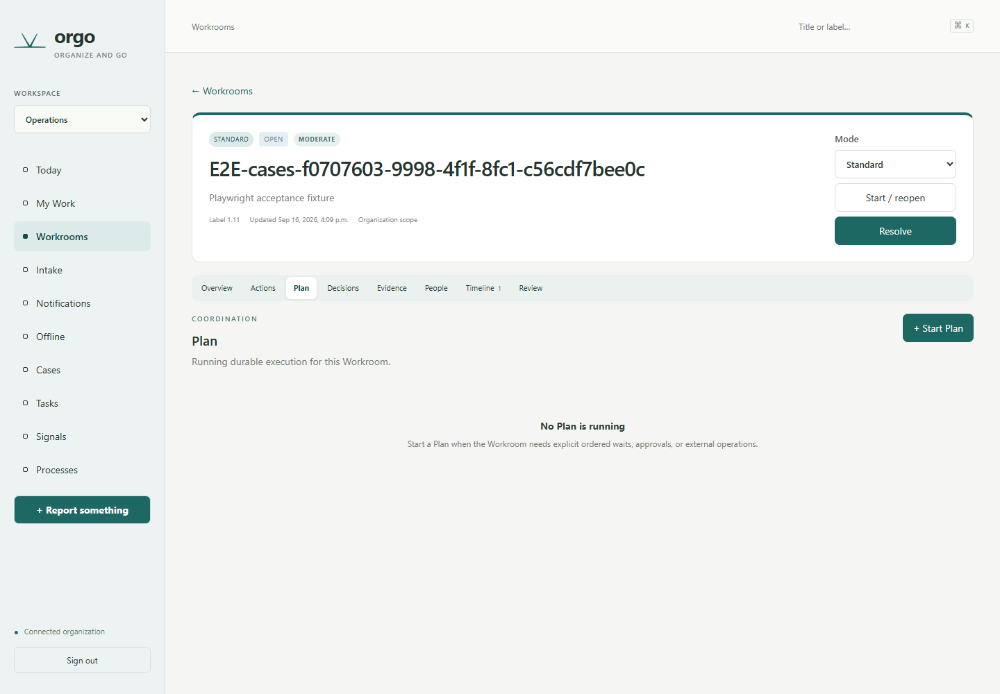

## Workroom — Decisions

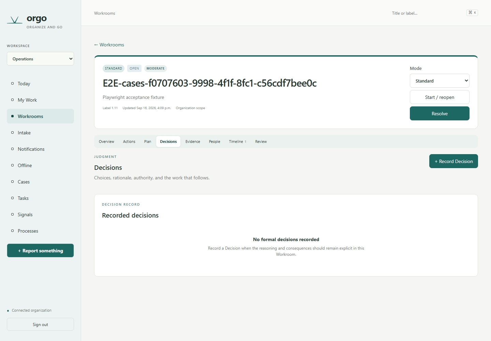

## Workroom — Evidence

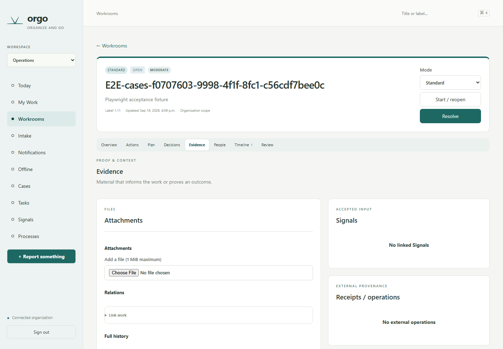

## Workroom — People

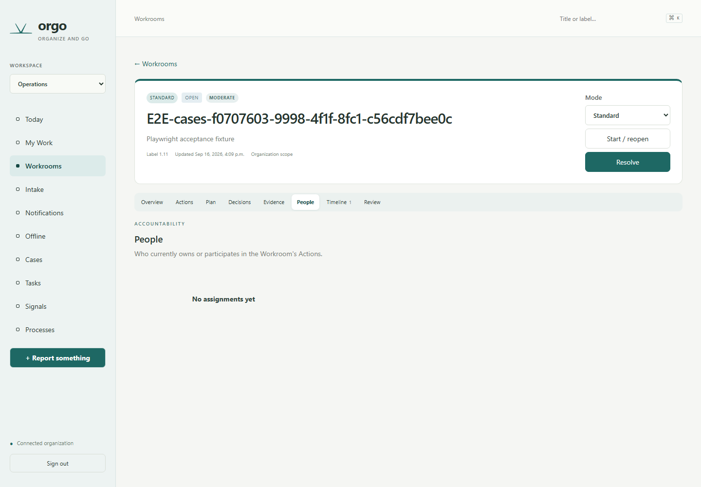

## Workroom — Timeline

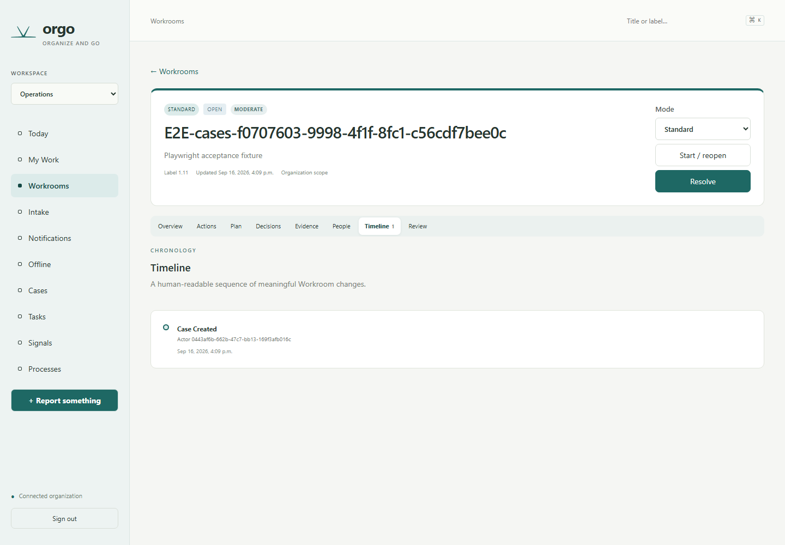

## Workroom — Review

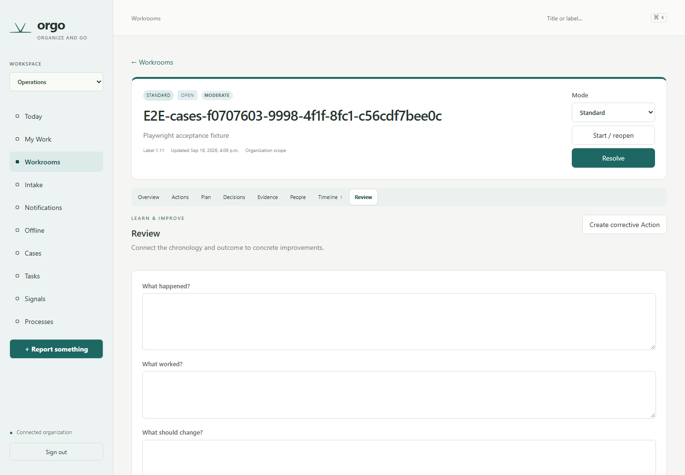

## Intake

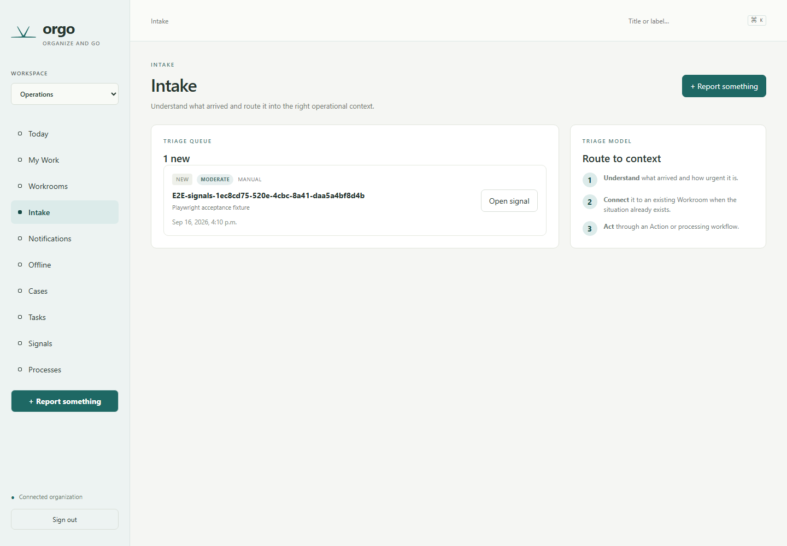

## Team

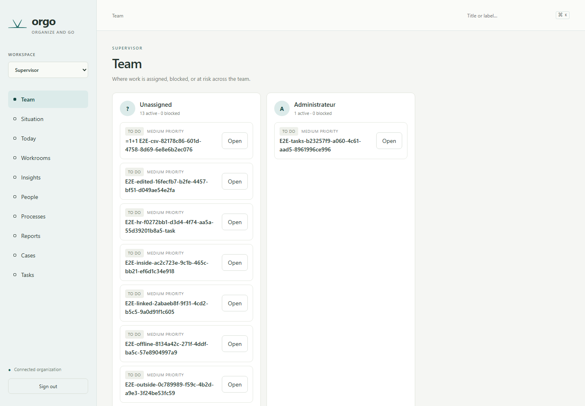

## Situation

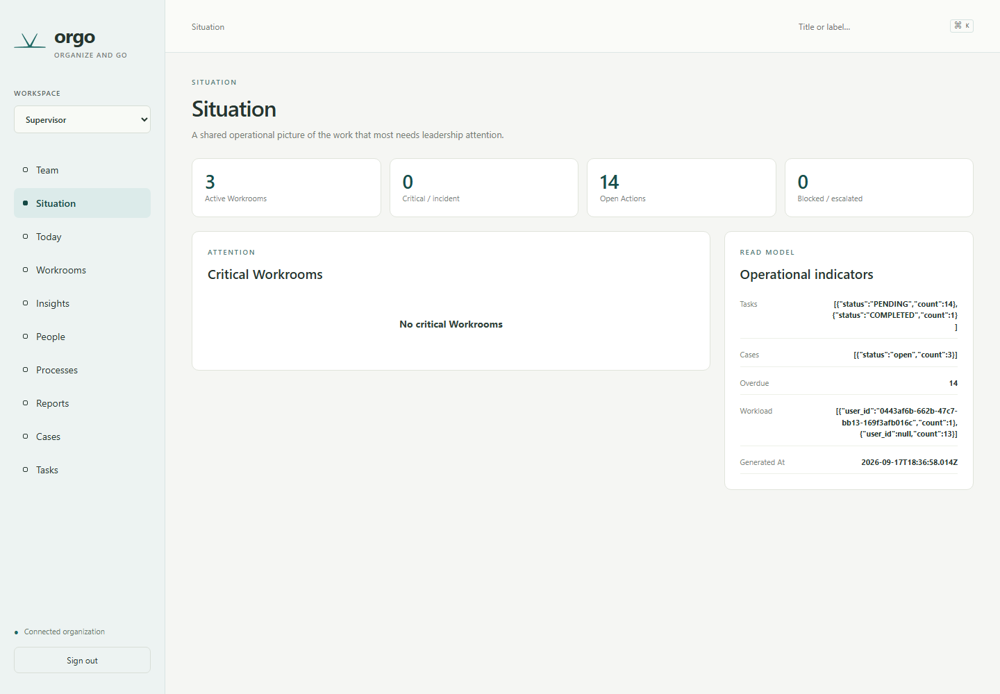

## Full Control Panel

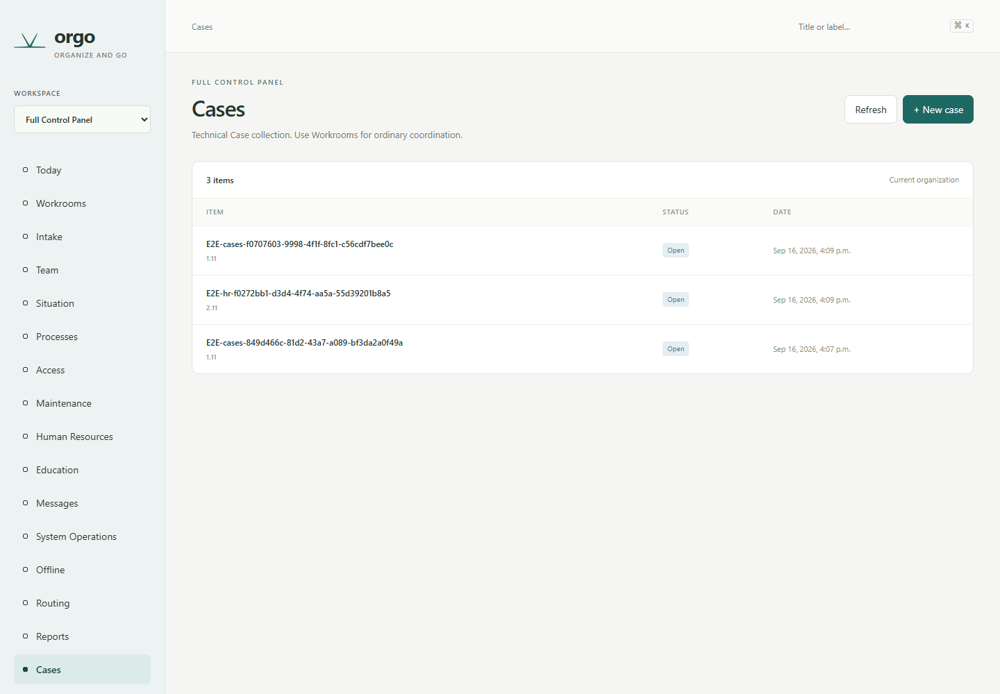

## Skipped

- Incident Workroom: no incident-mode Workroom exists in the current local dataset.
